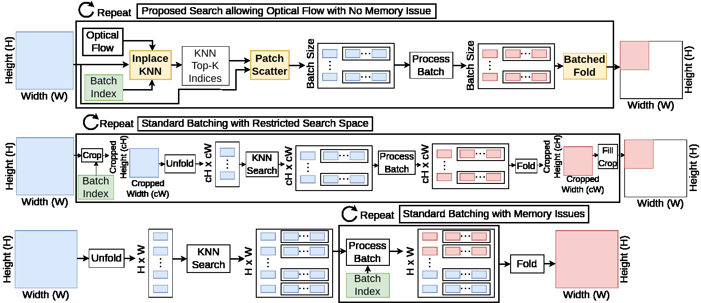

# dnls
Differentiable Non-Local Search: A suite of patch-based and batch-friendly CUDA operations within Pytorch.

## Summary

This package provides five primary functions: `search`, `ifold`, `iunfold`, `scatter`, and `gather`.
- `search` function provides a differentiable patch based search using the L2-norm allowing for optical flow to be used between frames.
- `ifold` is a batched version of Pytorch `fold` that can operate on arbitrary rectangular regions. 
- `iufold` is a batched version of Pytorch `unfold` that can operate on arbitrary rectangular regions.
- `scatter` is a patch-based version of Pytorch `scatter`, extracting the K nearest-neighbor patches with an index tensor (NxKx3). This is a patch-based version of Pytorch's `scatter`.
- `gather` is a patch-based version of Pytorch `gather`, grouping the K nearest-neighbor patches with an index tensor (NxKx3). This is a patch-based version of Pytorch's `gather`.

Batching across patches places an upper-bound on the 
memory consumption of any patch-based method. This allows patch-based methods
to scale to huge image resolutions (from 256x256 to 5000x5000) and to long videos (from 4 to 128). 

Operating on arbitrary rectangular regions enables methods to be applied
to fixed or dynamically chosen regions.
Examples of fixed regions include hard mining examples for training a network -- since many patches are "flat" (in terms of content) training on more interesting regions such as textures may improve training statistics. Examples of dynamically chosen regions include using a deep networks to propose the coordinates itself. Such a network can specify regions (i) for more processing or (ii) to skip regions that don't need extra computation.

## Install & Usage

```bash
git clone https://github.com/gauenk/dnls
cd dnls
python -m pip install -e ./lib --user
```

See [`scripts/example_folds.py`]() and [`scripts/example_nls.py`]() for an example usages.

## Patch-based Processing: Graph Neural Networks, Attention, and Non-Local Denoising

We would like to be able to operate on image patches, rather than the entire image. 
This is motivated by research such as [Graph Neural Networks](https://arxiv.org/abs/1812.08434), [VIT](https://arxiv.org/pdf/2010.11929.pdf), [NAT](https://arxiv.org/abs/2204.07143), and [LIDIA](https://arxiv.org/pdf/1911.07167.pdf).
Operating on image patches allows patch information to be transformed independently from it's neighbor.
Another motivation for operating on patches comes from operating on tokens from natural language processing.


Since I am studying image denoising, I note non-local denoising methods are a type of [transformer](https://openreview.net/pdf?id=MmujBClawFo) and also a [graph neural networks](https://arxiv.org/abs/1905.12281) (since [transformers are a special case of graph nerual networks](https://graphdeeplearning.github.io/post/transformers-are-gnns/)). 
These operations often look like the following code block,

```python
patches = unfold(video)
patches_mod = model(patches)
vide_mod = fold(patches_mod)
```

Runnning `unfold` on the entire video at once
requires tons of GPU memory.
This code base provides differentiable, patch-based, 
batch-friendly (or video friendly) CUDA operations 
within Pytorch to place a cap on the memory requirement
using the following pseudo-code,


```python
nbatches = (npixels-1)//batch_size + 1
for batch in range(nbatches):
    patch_batch = unfold(video,batch)
    patch_batch_mod = model(patch_batch)
    video_mod += fold(patch_batch_mod,batch)
```

## Current Batching Alternative for GNNs



This graphic compares methods for scaling GNNs. The top graphic depicts our proposed search that allows users to include optical flow and allows scaling to high-dimensional images and long videos. The middle graphic depicts processed batches of patches using cropped image regions, but limits the KNN search space. The bottom graphic depicts processing batches of patches after the entire image is unfolded, but yields out of memory errors when scaling the input data. This repo presents the differentiable functions named *Inpalace KNN*, *Patch Scatter*, and *Batched Fold* colored in yellow.

## The Memory Cost of [Fold](https://pytorch.org/docs/stable/generated/torch.nn.Fold.html) and [Unfold](https://pytorch.org/docs/stable/generated/torch.nn.Unfold.html)

The fold and unfold operations native to Pytorch handle the transformation between (i) a batch (B) of images (sized HxWxC) to (ii) a batch (B) of image patches (sized PxPxC). 
The total memory cost for a unfolding a single image is HxWxPxPxC. We would like to also separately tile and process each patch's K neareset neighbors, requiring
a memory cost of HxWxKxPxPxC (see `scatter`). An example color image (C=3) of size HxW = 256x256 with patch size P = 11 and K = 14 neighbors requires about 4.96 GB using float32. 
This memory expansion of x1694 (originally only ~3MB) for *only the data* (no deep networks yet) limits the use of patch-based networks. This memory requirement for data creates the following problems:

- Limited Resolution: The example image of 512x512 is small compared to standard native image resolution from cameras. For example, the iPhone 11 camera has 1792x828 pixels.
- Limited Frames for Video Processing: Using multiple frames for video processing increases the quality of many algorithms because of the shared information between frames. However, the resolution of each frame dramatically contrains the number of frames as all T frames are unfolded at once. 
- Limited Batch Size for Image Processing: The memory cost implies a $2,4000 GPU (a Titan RTX has 24 GB) is limited to only a batch size of 4, while standard training procedures use batch sizes of 32 (small), 64, 128. 
Transformers commonly use larger batch sizes such as 1024 or 2048.

## Related Code

In this section, we distinguish this code-based from similar code:

[NAT](https://github.com/SHI-Labs/Neighborhood-Attention-Transformer): This paper proposes using a neighborhood window for the attention map, rather than the entire image. A core CUDA kernel, [linked here](https://github.com/SHI-Labs/Neighborhood-Attention-Transformer/blob/main/natten/src/nattenqkrpb_cuda_kernel.cu), efficiently computes a neighborhood dot-product between Q and V. The `dnls` code base's `search`
function is similar, but we compute patch similarity (i) using an optional optical flow
and (ii) using the L2-norm instead of the dot product.
 
[N3Net](https://github.com/visinf/n3net): This paper proposes a differentiable non-local K nearest neighbors search. Core CUDA kernels are [linked here](https://github.com/visinf/n3net/blob/master/lib/matmul1_kernel.cu) and [here](https://github.com/visinf/n3net/blob/master/lib/matmul1_bwd_kernel.cu). These kernels allow for efficient multiplication using indices in 1d. However, this kernel is only used for testing. For training, they compute the nearest neighbors search by first expanding the entire search space of features, say 1,000 - 5,000 sets of features, for each search location in the batch. This duplicatation of data consumes large amounts of GPU memory. 

[pyinn](https://github.com/szagoruyko/pyinn): This project combines Cupy and Pytorch functions. A core CUDA kernel, [linked here](https://github.com/szagoruyko/pyinn/blob/948388e4ee585b23ed41d352fc8863ea868874ad/pyinn/im2col.py#L48), computes the fold and unfold (im2col and col2im) functions. Their code does not allow for batching, so it is limited in the same way as standard fold and unfold.
