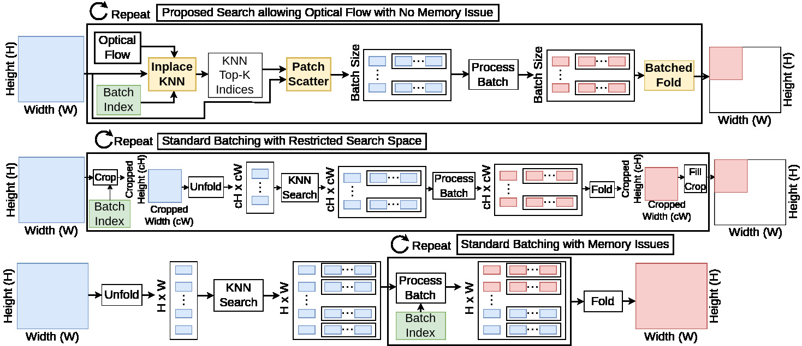

# dnls
Differentiable Non-Local Search: A suite of patch-based and batch-friendly CUDA operations within Pytorch.

## Summary

This package provides five primary functions: `search`, `ifold`, `iunfold`, `scatter`, and `gather`.
- `search` function provides a differentiable patch based search using the L2-norm allowing for optical flow to be used between frames.
- `ifold` is a batched version of Pytorch `fold` that can operate on arbitrary rectangular regions. 
- `iufold` is a batched version of Pytorch `unfold` that can operate on arbitrary rectangular regions.
- `scatter` is a patch-based version of Pytorch `scatter`, extracting the K nearest-neighbor patches with an index tensor (NxKx3). This is a patch-based version of Pytorch's `scatter`.
- `gather` is a patch-based version of Pytorch `gather`, grouping the K nearest-neighbor patches with an index tensor (NxKx3). This is a patch-based version of Pytorch's `gather`.

Batching across patches places an upper-bound on the 
memory consumption of any patch-based method. This allows patch-based methods
to scale to huge image resolutions (from 256x256 to 5000x5000) and to long videos (from 4 to 128 frames). 

Operating on arbitrary rectangular regions enables methods to be applied to fixed or dynamically chosen regions.
Examples of fixed regions include hard mining examples for training a network -- since many patches are "flat" (in terms of content) training on more interesting regions such as textures may improve training statistics. Examples of dynamically chosen regions include using a deep networks to propose the coordinates itself. Such a network can specify regions (i) for more processing or (ii) to skip regions that don't need extra computation.

## Install & Usage

```bash
git clone https://github.com/gauenk/dnls
cd dnls
python -m pip install -e ./lib --user
```

See [`scripts/example_folds.py`]() and [`scripts/example_nls.py`]() for an example usages.

## Abstract

Graph neural networks (GNN), including transformers, are currently the best methods for video restoration. Many GNNs operate on non-local image patches retrieved with a K-nearest neighbors (KNN) search, which requires a large amount of GPU memory. Existing methods scale GNNs by operating on cropping images, incurring edge effects dependent on the batch size and reducing the quality of the KNN search space while making the use of optical flow unclear or impossible. Even when scaled, the runtime of the KNN's backpropagation step increases linearly with video length and resolution resulting in a wall-clock time of several seconds. This paper presents a computational method to decouple GPU memory consumption and GNN patch-based operations. Our method, named scaled non-local patches (SNOP), provides three major functions: (i) maintains the ideal KNN search space and allows the use of optical flow for any batch size, (ii) allows GNNs to operate on arbitrary rectangular space-time volumes without edge effects from the choice of batchsize, and (iii) provides efficient backpropagation for non-local patches. Our method is divided into functions that require structural changes to GNN codebases, and we demonstrate these changes by integrating our method into eight existing GNNs. These models are used for video denoising, deblurring, and super-resolution. We show our method allows existing methods to extend to new datasets, improves the restoration quality of existing methods, and reduces the execution-time for backpropagation through non-local patches.

## Current Batching Alternative for GNNs



This graphic compares methods for scaling GNNs. The top graphic depicts our proposed search that allows users to include optical flow and allows scaling to high-dimensional images and long videos. The middle graphic depicts processed batches of patches using cropped image regions, but limits the KNN search space. The bottom graphic depicts processing batches of patches after the entire image is unfolded, but yields out of memory errors when scaling the input data. This repo presents the differentiable functions named *Inpalace KNN*, *Patch Scatter*, and *Batched Fold* colored in yellow.

## The Memory Cost of [Fold](https://pytorch.org/docs/stable/generated/torch.nn.Fold.html) and [Unfold](https://pytorch.org/docs/stable/generated/torch.nn.Unfold.html)

The fold and unfold operations native to Pytorch handle the transformation between (i) a batch (B) of images (sized HxWxC) to (ii) a batch (B) of image patches (sized PxPxC). 
The total memory cost for a unfolding a single image is HxWxPxPxC. We would like to also separately tile and process each patch's K neareset neighbors, requiring
a memory cost of HxWxKxPxPxC (see `scatter`). An example color image (C=3) of size HxW = 256x256 with patch size P = 11 and K = 14 neighbors requires about 4.96 GB using float32. 
This memory expansion of x1694 (originally only ~3MB) for *only the data* (no deep networks yet) limits the use of patch-based networks. This memory requirement for data creates the following problems:

- Limited Resolution: The example image of 512x512 is small compared to standard native image resolution from cameras. For example, the iPhone 11 camera has 1792x828 pixels.
- Limited Frames for Video Processing: Using multiple frames for video processing increases the quality of many algorithms because of the shared information between frames. However, the resolution of each frame dramatically contrains the number of frames as all T frames are unfolded at once. 
- Limited Batch Size for Image Processing: The memory cost implies a $2,4000 GPU (a Titan RTX has 24 GB) is limited to only a batch size of 4, while standard training procedures use batch sizes of 32 (small), 64, 128. 
Transformers commonly use larger batch sizes such as 1024 or 2048.

